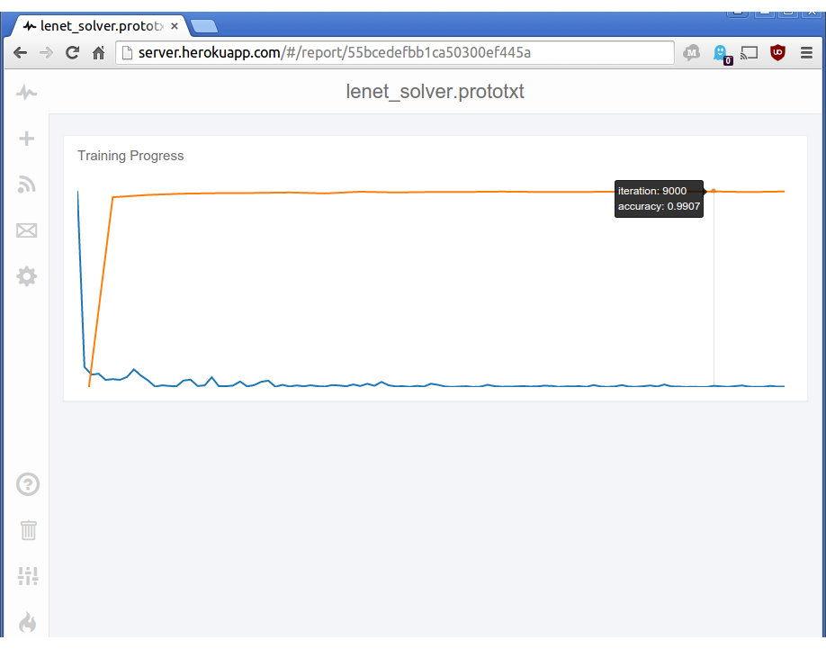

.. mri documentation master file, created by
   sphinx-quickstart on Fri Jul 31 12:50:25 2015.
   You can adapt this file completely to your liking, but it should at least
   contain the root `toctree` directive.

Welcome to Mri's documentation!
===============================

Mri is a set of tools and applications to allow you to easily monitor neural network training from anywhere.

Included in Mri is:

* Mri-server_: A webserver based on Reportr_ that allows you to easily monitor training from anywhere.
* Mri-client-python_: A Python interface to the server API for use with Theano/Pylearn/Blocks/Keras/etc.
* Mri-app_: An interface to Caffe to enable easy hyperparameter testing and monitoring of multiple network architectures. 

.. _Mri-server: https://github.com/Mri-monitoring/Mri-server
.. _Mri-client-python: https://github.com/Mri-monitoring/Mri-python-client
.. _Mri-app: https://github.com/Mri-monitoring/Mri-app

.. warning::
    Mri is a new project and is currently under development. All projects and APIs are subject to change, and 
    while incompatability warnings will be released, you should not expect long term stability. Windows is not 
    yet supported, although as long as you have a proper Python installation you should be okay.

.. tip::
    If you are interested in Mri, please feel free to open issues on Github_, and to contribute via pull requests.

.. _Reportr: https://github.com/Reportr/dashboard
.. _Github: https://github.com/Mri-monitoring

Contents:

.. toctree::
   :maxdepth: 1
    
   getting_started.rst
   mriserver.rst
   mriapp.rst
   mripython.rst
   python/index.rst
   app/index.rst

Indices and tables
==================

* :ref:`genindex`
* :ref:`modindex`
* :ref:`search`
